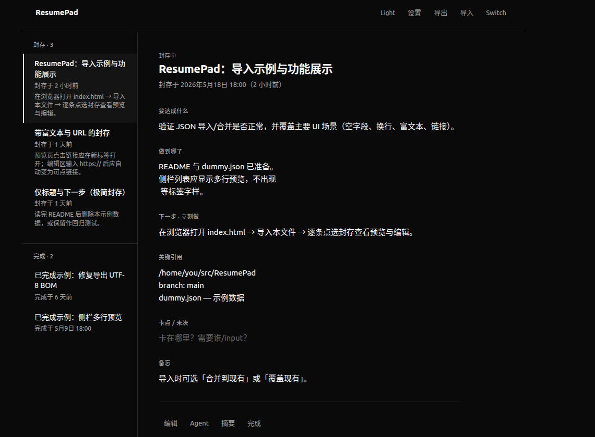

# ResumePad

[English](README.en.md) · 中文

任务切换时的上下文记录小工具。在被打断或换任务前，把「目标、进度、下一步」等写清楚；回来时从左侧列表点选，几分钟内接上上次的工作状态。

**仅支持通过 [Electron 安装包](https://github.com/jizhiwen/ResumePad/releases) 安装使用**（Ubuntu / Windows）。不支持双击 `index.html`、浏览器直接打开，也不提供脚本安装快捷方式。



> 本仓库代码由 [Cursor](https://cursor.com) 辅助生成。

## 安装

在 GitHub **Releases** 页面下载与系统匹配的安装包（推送 `v*` 标签后会由 CI 自动构建并发布）。

| 平台 | 推荐 | 备选 |
|------|------|------|
| **Ubuntu** | `ResumePad-*-linux-x64.AppImage`（免安装，`chmod +x` 后双击） | `ResumePad-*-linux-x64.deb`（`sudo apt install ./ResumePad-*.deb`） |
| **Windows** | `ResumePad-Setup-*-x64.exe`（安装包） | `ResumePad-Portable-*-x64.exe`（免安装） |

**Ubuntu AppImage 提示：** 若无法运行，可安装 FUSE：`sudo apt install libfuse2`（22.04）或 `libfuse3`（24.04+）。

安装后从应用菜单或开始菜单启动 **ResumePad**。

## 快速开始

1. 安装并打开 ResumePad。
2. **（可选）** 顶部 **导入** → 选择 [`docs/dummy.json`](docs/dummy.json) 体验示例数据。
3. 需要切换任务时，点击 **切换**（或 `N`），保存后可在左侧 **排队中** 列表恢复上下文；预览页可 **编辑** 或双击区块修改。

## 数据存储

- 任务数据保存在本机 **IndexedDB**（`resumepad_db`），不会上传到任何服务器。
- 建议定期 **导出** JSON 备份；换机或重装前务必先导出。

### 用户数据目录

| 平台 | 路径 |
|------|------|
| Linux | `~/.config/resumepad/` |
| Windows | `%APPDATA%\resumepad\` |

**何时创建：** 首次启动 Electron 版时自动创建。路径为 Electron 标准的 `app.getPath('userData')`（与 `package.json` 的 `name` 字段一致，见 `resumepad`），整个目录作为 Chromium 用户配置根。

```
~/.config/resumepad/          # Linux
├── window-bounds.json
├── Default/
│   ├── IndexedDB/          # 任务 resumepad_db
│   └── Local Storage/
├── Cache/
└── …
```

| 路径 / 文件 | 何时写入 | 说明 |
|-------------|----------|------|
| `Default/IndexedDB/` | 首次有任务/设置读写后 | 封存、完成历史、设置 |
| `Default/Local Storage/` | 首次启动后 | `resumepad_theme`、`resumepad_sidebar_width` |
| `window-bounds.json` | 首次调整或关闭窗口时 | `{"w":960,"h":500,"x":80,"y":50}` 等形式 |

若曾安装旧版 Edge 脚本，改用 Electron 前请**手动**删除：

```bash
rm -f ~/.local/bin/resumepad ~/.local/share/applications/resumepad.desktop
rm -rf ~/.local/opt/resumepad
rm -rf ~/.config/resumepad/app-root ~/.config/resumepad/edge-profile
```

然后从 [Releases](https://github.com/jizhiwen/ResumePad/releases) 安装 AppImage 或 `.deb` 启动。

卸载 Electron 版不会自动删除 `~/.config/resumepad/`；清空数据前请先 **导出** JSON。

## 界面说明

| 区域 / 按钮 | 作用 |
|-------------|------|
| **排队中** | 活动任务，按入队时间排序；点选打开详情 |
| **已完成** | 已标记完成的任务（永久保留，直至手动删除） |
| **切换** | 新建任务表单（保存后加入排队） |
| **设置** | 界面语言（中文 / English）、外观（浅色/深色）、配置「摘要」复制字段（语言与摘要随 JSON 导出/导入；主题存于本机） |
| **编辑** | 预览页底部进入编辑（与双击区块等效） |
| **Agent** | 一键复制面向 AI 助手的恢复提示词 |
| **摘要** | 按设置复制 Markdown 格式的任务摘要 |
| **完成** | 将当前活动任务移入已完成 |
| **导出 / 导入** | JSON 备份与恢复（支持合并或覆盖） |
| **设置 · 外观** | 浅色 / 深色主题（快捷键 `T` 仍可切换） |

每条活动任务包含这些字段，便于「回来先读什么、立刻做什么」：

- **要达成什么** — 目标与成功标准  
- **软件需求（SRS）** — 功能范围、验收标准、约束等（给人与 Agent 阅读；随摘要 / Agent 提示词一并复制）  
- **做到哪了** — 已完成与刚试过的结论  
- **下一步 · 立刻做** — 恢复后第一件事  
- **关键引用** — 路径、分支、URL、命令等  
- **卡点 / 未决** — 阻塞与待决问题  
- **备忘** — 其他需要记住的信息  
- **复盘总结** — 做得好的、待改进的、经验与结论（随摘要 / Agent 一并复制）  
- **附件** — 上传 `.html` / `.htm` / `.md` 文件，单击在弹窗中预览；列表与预览内均可 **下载** 原始文件  

预览页会**始终显示**上述区块；无内容时显示灰色占位提示。富文本区域支持粘贴或拖入图片；**双击图片**可放大预览，预览中 **Ctrl+滚轮** 缩放、**左键拖动** 平移；编辑时 URL 可自动识别为可点击链接。附件预览中 HTML 在沙箱 iframe 中展示，Markdown 渲染为可读页面。

## 示例数据

仓库提供 [`docs/dummy.json`](docs/dummy.json)（`version: 3`），含 SRS、复盘总结与附件示例。**导入：** 顶部 **导入** → 选择文件 → **合并到现有** 或 **覆盖现有**。

## 快捷键

| 按键 | 功能 |
|------|------|
| `N` | 切换（新建任务表单） |
| `T` | 切换浅色 / 深色主题 |
| `Enter` | 编辑状态下保存 |
| `Alt+Enter` | 编辑状态下换行 |
| `Tab` / `Shift+Tab` | 编辑状态下切换到下一/上一编辑框 |
| `Esc` | 关闭图片预览，或在编辑表单中取消并返回浏览 |
| `Ctrl` + 滚轮 | 图片预览中缩放 |
| 左键拖动 | 图片预览中平移 |

## 发布新版本（维护者）

推送符合 `v*` 的 tag 后，GitHub Actions 会在 Ubuntu 与 Windows 上分别构建安装包，并创建 Release：

```bash
git tag v1.0.2
git push origin v1.0.2
```

产物：`ResumePad-*-linux-x64.AppImage`、`.deb`、`ResumePad-Setup-*-x64.exe`、`ResumePad-Portable-*-x64.exe`（文件名均为连字符，无空格）。

## 从源码构建（开发者）

| 要求 | 说明 |
|------|------|
| Node.js | **18+**（推荐 20，见 `.nvmrc`） |
| Linux 额外依赖 | `librsvg2-bin`（图标）、`libfuse2`（AppImage，Ubuntu 22.04） |

```bash
nvm use 20
./scripts/build-electron.sh linux   # 含 npm ci 与 Node 版本检查
./scripts/build-electron.sh win     # 仅 Windows（建议在 windows-latest 上构建）
npm start                           # 开发调试
```

产物在 `dist/`。

## 项目结构

```
ResumePad/
├── .github/workflows/release.yml   # tag 触发自动 Release
├── electron/main.js                # Electron 主进程
├── package.json                    # 构建配置
├── index.html                      # UI 与逻辑（单文件）
├── scripts/build-electron.sh       # 本地构建脚本
├── scripts/electron-icons.sh
├── icons/
├── docs/                           # 截图、示例数据
│   └── dummy.json
├── README.en.md                    # English README
└── README.md
```

## 许可与说明

个人工具，按现状提供。数据安全与备份请自行负责。
