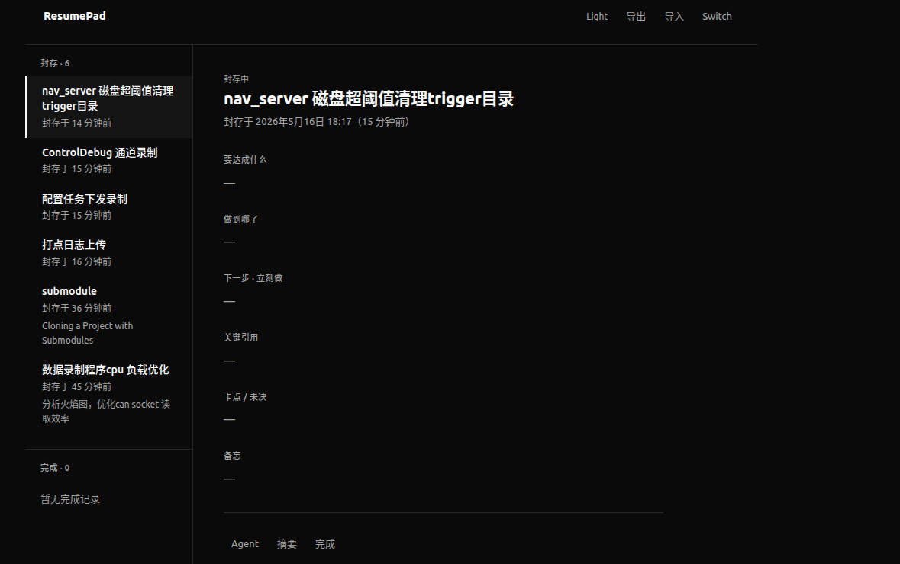

# ResumePad

任务切换时的上下文记录小工具。在被打断或换任务前，把「目标、进度、下一步」等写清楚；回来时从左侧列表点选，几分钟内接上上次的工作状态。

单文件静态页面，**无需安装、无需服务器**，用浏览器直接打开 `index.html` 即可使用。作者仅在 **Microsoft Edge** 上做过日常使用验证；理论上其他现代浏览器（Chrome、Firefox 等）也可运行，但未逐一测试。



> 本仓库代码由 [Cursor](https://cursor.com) 辅助生成。

## 快速开始

1. 克隆或下载本仓库。
2. 双击 `index.html`，或在 Edge 地址栏输入本地路径，例如：`file:///home/you/src/ResumePad/index.html`。
3. 需要切换任务时，点击顶部 **Switch**（或按 `N`），填写/更新上下文后保存。
4. 回到某任务时，在左侧 **封存** 列表中点选即可浏览；双击正文区块可进入编辑。

## 界面说明

| 区域 | 作用 |
|------|------|
| **封存** | 进行中的任务，按封存时间排序 |
| **完成** | 已标记完成的任务（默认保留约 14 天） |
| **Switch** | 新建封存或切换编辑当前任务 |
| **Agent** | 一键复制面向 AI 助手的恢复提示词 |
| **摘要** | 复制 Markdown 格式的任务摘要 |
| **完成** | 将当前封存移入完成历史 |
| **导出 / 导入** | JSON 备份与恢复（支持合并或覆盖） |
| **Light / Dark** | 主题切换（快捷键 `T`） |

每条封存包含这些字段，便于「回来先读什么、立刻做什么」：

- **要达成什么** — 目标与成功标准  
- **做到哪了** — 已完成与刚试过的结论  
- **下一步 · 立刻做** — 恢复后第一件事  
- **关键引用** — 路径、分支、URL、命令等  
- **卡点 / 未决** — 阻塞与待决问题  
- **备忘** — 其他需要记住的信息  

富文本区域支持粘贴或拖入图片（会自动压缩后存入本地数据库）。

## 快捷键

| 按键 | 功能 |
|------|------|
| `N` | Switch（新建/切换任务表单） |
| `T` | 切换浅色 / 深色主题 |
| `Esc` | 在编辑表单中取消并返回浏览 |

## 数据存储

- 数据保存在浏览器 **IndexedDB**（`resumepad_db`），仅本机、仅当前浏览器配置，不会上传到任何服务器。
- 建议定期使用 **导出** 做 JSON 备份；换机或清缓存前务必先导出。
- 若曾使用旧版 localStorage，首次打开会自动迁移到 IndexedDB。

## 项目结构

```
ResumePad/
├── index.html                      # 全部 UI 与逻辑（单文件）
├── screenshot-20260516-183301.png  # 界面示例截图
└── README.md
```

## 许可与说明

个人工具，按现状提供。数据安全与备份请自行负责。
